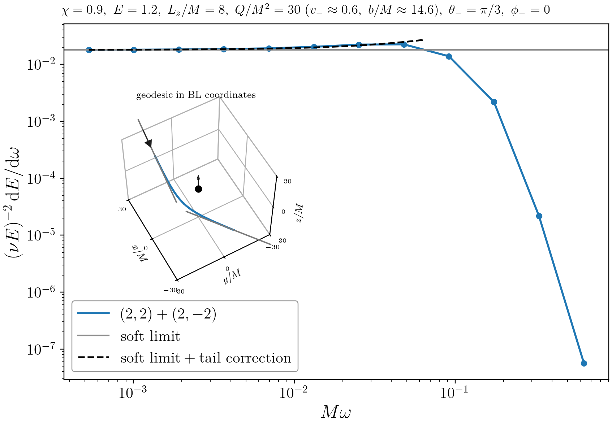

# KerrUnboundWaveforms

Kerr 背景上一般非束缚测试点粒子轨道的频域引力波形求解器。

## 用法

```powershell
$env:JULIA_NUM_THREADS = 16  # Julia 并行线程数；按可用物理核心数调整
julia --project=.
```

```julia
using KerrUnboundWaveforms

config = SpectrumConfig(
    a=0.9,                         # 无量纲自旋 \chi=a/M
    energy=1.2,                    # 单位静止质量的无穷远能量 E；非束缚轨道要求 E>1
    lz=8.0,                        # 轴向角动量 L_z/M
    carter_q=30.0,                 # Carter 常数 Q/M^2
    theta_infinity=pi / 3,         # (BL坐标下) 入射方向 \theta_-
    phi_infinity=0.0,              # (BL坐标下) 入射方向 \phi_-
    theta_sign=1.0,                # 入射端 \theta 的初始增大方向
    orbit_kind="scattering",      # "scattering" 或 "plunge"
    frequency_count=12,            # 求解的正频率点数
    omega_min=NaN,               # 如果不填数值，NaN 自动选择最低频率
    low_frequency_ratio=0.005,     # 仅 omega_min=NaN 时使用
    mode_policy="explicit",       # "explicit"、"dominant" 或 "auto"
    explicit_modes=[(2, 2), (2, -2)], # mode_policy="explicit" 时的球谐模式集合
)
result = solve(config)
save(result, "output")
```

## 例子


